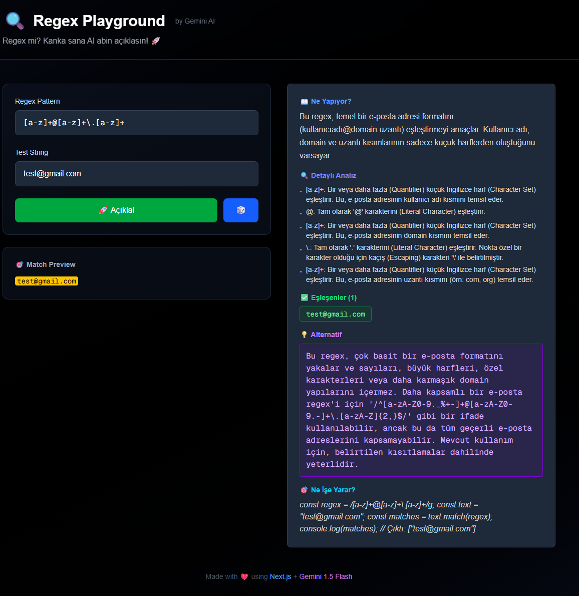

# 🔍 Regex Playground with Gemini AI



## 📖 Proje Hakkında

Bu web uygulaması, **regex (düzenli ifadeler)** öğrenme ve anlama konusunda zorluk çekenler için geliştirilmiş interaktif bir eğitim platformudur. Gemini AI desteği ile regex pattern'lerinizi anlık olarak analiz eder, Türkçe açıklamalar sunar ve alternatif çözümler önerir.

### Neden Bu Proje?

Regular Expression (Regex), yazılım geliştirmede güçlü bir araçtır ancak karmaşık sözdizimi nedeniyle öğrenmesi zor olabilir. Bu platform:
- Regex pattern'lerinizi **anında açıklar**
- **Eşleşen kısımları görsel olarak vurgular**
- **Hataları tespit eder** ve düzeltme önerileri sunar
- **Alternatif ve daha optimize regex** önerileri sağlar
- Tamamen **Türkçe** ve samimi bir dil kullanır

## 🛠️ Teknolojiler

Bu proje tamamen **frontend tabanlı** olup, herhangi bir backend veritabanına ihtiyaç duymaz:

- **Framework**: [Next.js 16.0.3](https://nextjs.org/) (App Router)
- **UI Library**: React 19 + TypeScript
- **Styling**: Tailwind CSS 4
- **AI Engine**: [Google Gemini 2.5 Flash](https://ai.google.dev/) (Ücretsiz API)
- **Markdown Rendering**: react-markdown
- **Deployment**: Vercel Ready

## ✨ Özellikler

- 🤖 **AI Destekli Açıklama**: Gemini 2.5 Flash ile kısa, net ve Türkçe açıklamalar
- 🎯 **Anlık Match Highlighting**: Test string'inizde eşleşen kısımları canlı görün
- ⚡ **Hata Tespiti**: Regex'inizde sorun varsa AI uyarır ve düzeltme önerir
- 💡 **Alternatif Öneriler**: Daha kısa veya optimize regex seçenekleri
- 🎲 **Rastgele Örnekler**: Öğrenmek için hazır regex örnekleri
- 🌙 **Karanlık Tema**: Göz dostu modern arayüz
- 📝 **Markdown Desteği**: Açıklamalarda kod bloğu ve vurgulama

## 🚀 Kurulum

### 1️⃣ Repoyu Klonlayın

```bash
git clone https://github.com/htunc29/regex-kanka.git
```

### 2️⃣ Bağımlılıkları Yükleyin

```bash
npm install
```

### 3️⃣ Environment Değişkenlerini Ayarlayın

Projenin çalışması için **Gemini API anahtarı** gereklidir:

1. [Google AI Studio](https://aistudio.google.com/apikey) adresinden **ücretsiz** API anahtarı alın
2. Proje kök dizininde `.env.local` dosyası oluşturun
3. Aşağıdaki değişkenleri ekleyin:

```env
GEMINI_API_KEY=your_api_key_here
GEMINI_MODEL=gemini-2.5-flash
```

> **Not**: `.env.example` dosyasını kopyalayıp `.env.local` olarak kaydedebilirsiniz.

### 4️⃣ Geliştirme Sunucusunu Başlatın

```bash
npm run dev
```

Tarayıcınızda [http://localhost:3000](http://localhost:3000) adresini açın.

## 📂 Proje Yapısı

```
regexapp/
├── src/
│   ├── app/
│   │   ├── page.tsx                  # Ana sayfa (client component)
│   │   ├── layout.tsx                # Global layout
│   │   └── api/
│   │       ├── gemini/route.ts       # Gemini API endpoint
│   │       └── test-models/route.ts  # Model test endpoint
│   ├── components/
│   │   ├── RegexInput.tsx            # Regex input bileşeni
│   │   ├── MatchHighlighter.tsx      # Match vurgulama bileşeni
│   │   └── ExplanationBox.tsx        # AI açıklama kutusu (Markdown desteği)
│   └── lib/
│       └── gemini.ts                 # Gemini client & prompt
├── .env.local                         # Environment değişkenleri (git'e eklenmez)
├── .env.example                       # Environment örneği
├── package.json
└── README.md
```

## 🎮 Kullanım

1. **Regex Pattern** alanına regex'inizi yazın
   Örnek: `^\d{4}$`

2. **Test String** alanına test metninizi girin
   Örnek: `2025 yılında doğdum, 1234 şifrem`

3. **"🚀 Açıkla!" butonuna basın**
   AI anında analiz eder ve açıklar

4. **Rastgele örnekleri deneyin**
   "🎲" butonuna tıklayarak hazır örnekleri keşfedin

## 📝 Örnek Kullanım

### 📧 Email Regex
```regex
Pattern: [a-z]+@[a-z]+\.[a-z]+
Test String: "Mail: test@gmail.com veya info@site.org"
```

**AI Açıklaması:**
> Bu regex `[a-z]+@[a-z]+\.[a-z]+` ile **basit email formatını** yakalar. `@` işareti öncesi ve sonrası küçük harfler, `.` sonrası uzantı arıyor.

### 🔢 4 Haneli Sayı
```regex
Pattern: ^\d{4}$
Test String: "2025 yılında 1234 şifrem"
```

**Eşleşenler:** `2025`, `1234`

## 🌐 Deploy (Production)

### Vercel ile Deploy

1. [Vercel](https://vercel.com) hesabınıza GitHub reposunu bağlayın
2. Environment değişkenlerini Vercel dashboard'dan ekleyin:
   - `GEMINI_API_KEY`
   - `GEMINI_MODEL`
3. Otomatik deploy başlayacaktır

**Manuel Deploy:**
```bash
npm install -g vercel
vercel --prod
```

## 🔧 Konfigürasyon

### Farklı Gemini Model Kullanma

`.env.local` dosyasında `GEMINI_MODEL` değişkenini değiştirebilirsiniz:

```env
# Hızlı ve ücretsiz (önerilen)
GEMINI_MODEL=gemini-2.5-flash

# Daha güçlü ama yavaş
GEMINI_MODEL=gemini-1.5-pro

# Deneysel modeller
GEMINI_MODEL=gemini-2.0-flash-exp
```

### Hangi Modeller Çalışıyor?

Tarayıcınızda şu URL'yi açarak API anahtarınızın desteklediği modelleri test edebilirsiniz:

```
http://localhost:3000/api/test-models
```

## 🤝 Katkıda Bulunma

Katkılarınız memnuniyetle karşılanır! Özellikle:

- 📚 Yeni regex örnekleri eklemek
- 🎨 UI/UX iyileştirmeleri
- 🧠 Prompt engineering (AI'ın daha iyi açıklama yapması)
- 🐛 Bug fix'ler
- 🌍 Çoklu dil desteği

**Pull Request göndermek için:**

1. Fork yapın
2. Feature branch oluşturun (`git checkout -b feature/amazing-feature`)
3. Commit edin (`git commit -m 'Add amazing feature'`)
4. Push edin (`git push origin feature/amazing-feature`)
5. Pull Request açın

## 📄 Lisans

Bu proje [MIT Lisansı](LICENSE) ile lisanslanmıştır. Özgürce kullanabilir, değiştirebilir ve dağıtabilirsiniz.

## 💡 İlham ve Motivasyon

Her yazılımcı hayatında en az bir kez regex ile boğuşmuştur. Regex öğrenmek zor, hatırlamak daha da zordur. Bu proje, regex'i **eğlenceli ve anlaşılır** hale getirmek için doğdu.

**Artık AI abin var!** 🤖

## 📞 İletişim ve Destek

- **Issues**: [GitHub Issues](https://github.com/htunc29/regex-kanka/issues)
- **Discussions**: Sorularınızı GitHub Discussions'da sorun
- **Sponsor**: Bu projeyi faydalı bulduysan ⭐ vermeyi unutma!

---

**Made with ❤️ using Next.js + Gemini AI**

© 2025 Regex Playground - Tüm hakları saklıdır.
